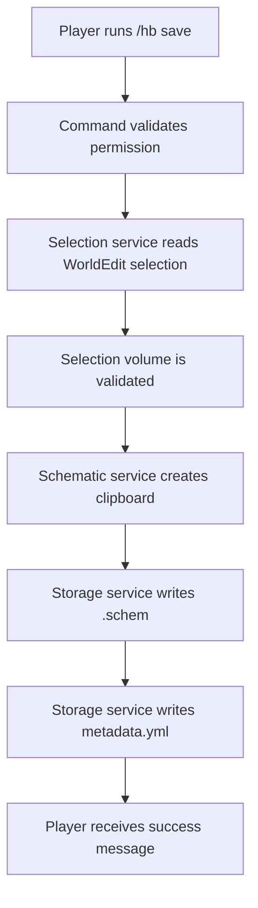
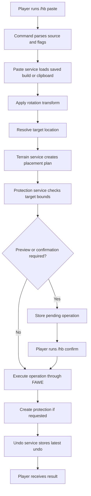
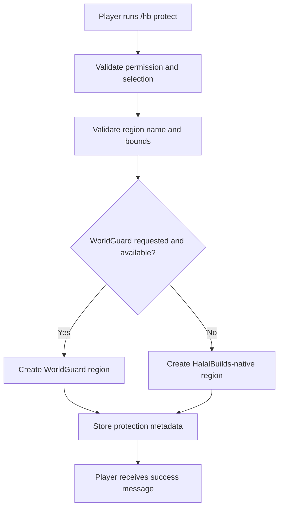
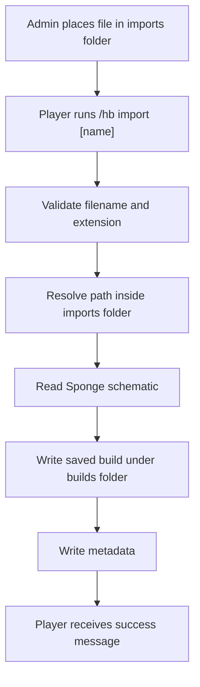

# HalalBuilds Technical Plan

## Architecture Overview

HalalBuilds should be organized around small services that separate Paper command handling, FAWE/WorldEdit operations, storage, terrain planning, and undo tracking.

Recommended package layout:

```text
com.halalbuilds
  HalalBuildsPlugin
  command
  config
  model
  selection
  storage
  schematic
  paste
  terrain
  protection
  undo
  util
```

## Main Components

### Plugin Bootstrap

`HalalBuildsPlugin` should:

- Load and validate configuration.
- Check that FAWE and WorldEdit APIs are available.
- Create plugin data folders.
- Register commands and permissions.
- Initialize services.
- Clean up pending operations and memory state on disable.

### Command Layer

The command layer should parse `/halalbuilds`, `/hb`, and `/halalbuild` commands.

Responsibilities:

- Validate sender type.
- Validate permissions.
- Parse arguments and flags.
- Call service methods.
- Return clear player-facing messages.

Command parsing should stay thin. It should not directly perform schematic I/O or block operations.

### Configuration Service

The configuration service should expose typed settings:

- Limits.
- Paste defaults.
- Foundation behavior.
- Protected material denylist.
- Import/export rules.
- Enabled/disabled worlds.
- FAWE dependency handling.

Invalid config values should be corrected to safe defaults or reported loudly on startup.

### Selection Service

The selection service should use WorldEdit or FAWE APIs to:

- Read a player's current selection.
- Validate selection completeness.
- Measure dimensions and volume.
- Convert selected regions to clipboards.

V1 selection behavior:

- Selection is cuboid-based.
- The full cuboid is copied as selected.
- The plugin does not automatically remove grass, dirt, or other terrain blocks from saved schematics.
- Players should select tightly around structures.
- Future clean-scan modes can be added above this service without changing the command surface.

### Schematic Service

The schematic service should:

- Read Sponge `.schem` files.
- Write Sponge `.schem` files.
- Convert WorldEdit clipboards into stored builds.
- Preserve origin offset for accurate paste alignment.

### Build Storage Service

The build storage service should own:

```text
plugins/HalalBuilds/builds/
plugins/HalalBuilds/imports/
plugins/HalalBuilds/exports/
```

Responsibilities:

- Validate names and filenames.
- Resolve paths safely inside plugin folders.
- Save build schematic and metadata.
- Load build schematic and metadata.
- List saved builds.
- Delete saved builds.
- Import from controlled import folder.
- Export to controlled export folder.

### Clipboard Service

The clipboard service should store temporary per-player clipboards in memory.

Clipboard data should include:

- Player UUID.
- Clipboard object or reference.
- Captured dimensions.
- Origin offset.
- Captured time.

### Paste Service

The paste service should coordinate:

- Saved build or clipboard source lookup.
- Rotation transform.
- Paste mode selection.
- Terrain plan creation.
- Preview requirement checks.
- Pending operation creation.
- Final execution through FAWE.
- Undo snapshot creation where practical.

### Terrain Service

The terrain service should build a plan before modifying the world.

The plan should include:

- Target paste bounds.
- Footprint columns.
- Intersecting blocks to clear.
- Foundation blocks to place.
- Denylisted blocks detected.
- Estimated block change count.
- Whether confirmation is required.

### Protection Service

The protection service should be introduced in v2.

Responsibilities:

- Track HalalBuilds-native protected cuboid regions.
- Check whether a player can modify a protected structure.
- Listen for block break and block place events inside native protected regions.
- Protect selected areas by command.
- Protect pasted structure bounds when `--protect` is used.
- Store protection metadata on disk.
- Bridge to WorldGuard when WorldGuard is installed and integration is enabled.

The core paste and cut services should call a protection abstraction instead of calling WorldGuard directly. This keeps WorldGuard optional and keeps HalalBuilds-native protection available on servers without WorldGuard.

### WorldGuard Hook

The WorldGuard hook should be optional and loaded only when WorldGuard is present.

When enabled, it should:

- Check existing WorldGuard regions before paste, cut, terrain clearing, and foundation operations.
- Block operations that the player is not allowed to perform.
- Create cuboid regions for protected pasted builds when requested.
- Apply configured default flags.
- Assign owners and members according to config and command options.

If WorldGuard is not installed, HalalBuilds should log that WorldGuard features are unavailable and continue with native protection if enabled.

### Undo Service

The undo service should store the latest undoable action per player.

Undo scope:

- Latest paste.
- Latest cut.

Undo should be bounded and best-effort. If the operation is too large to safely snapshot, the plugin should require confirmation and report limited undo support if necessary.

## Data Flow

### Save Flow



### Paste Flow



### Planned Protection Flow



### Import Flow



## Smart Foundation Algorithm

The default terrain placement mode should be `smart_foundation`.

### Inputs

- Clipboard or schematic dimensions.
- Clipboard origin offset.
- Target paste location.
- Rotation.
- Paste air setting.
- Foundation material.
- Clear terrain setting.
- Protected block denylist.
- Preview threshold settings.

### Steps

1. Compute rotated schematic bounds at the target location.
2. Determine occupied footprint columns from non-air schematic blocks.
3. Scan world blocks inside the target bounds.
4. Detect denylisted blocks inside affected bounds.
5. If denylisted blocks are found, stop or require admin override in a future version.
6. Identify terrain blocks that intersect non-air structure space.
7. If `clear-terrain-above-footprint` is enabled, identify extra blocks above the footprint that would visually collide with the structure.
8. For each footprint column, find the lowest structural block.
9. Fill empty space beneath that lowest structural block down to stable terrain or a configured max foundation depth.
10. Build a placement plan with clear operations, foundation operations, and paste operations.
11. Estimate total terrain changes.
12. Require preview or confirmation if thresholds are exceeded.
13. Execute the plan through FAWE.

### Air Handling

If `paste-air-blocks` is `true`, air from the schematic should clear space inside the structure.

If `paste-air-blocks` is `false`, schematic air should be ignored, except where smart foundation terrain clearing explicitly needs to remove intersecting terrain.

### Protected Blocks

The terrain planner must detect protected block types before executing changes.

Default denylist should include:

- `CHEST`
- `TRAPPED_CHEST`
- `BARREL`
- `SPAWNER`
- `BEDROCK`
- `COMMAND_BLOCK`
- `CHAIN_COMMAND_BLOCK`
- `REPEATING_COMMAND_BLOCK`
- `STRUCTURE_BLOCK`
- `JIGSAW`
- `END_PORTAL_FRAME`

## Exact Paste Mode

Exact mode should bypass smart terrain planning and paste the schematic directly at the target location using FAWE/WorldEdit operations.

Exact mode still must:

- Validate world enablement.
- Validate volume limits.
- Apply rotation.
- Respect `paste-air-blocks`.
- Create undo data where practical.

## Rotation Plan

Rotation must support:

- `0`
- `90`
- `180`
- `270`

Rotation should use WorldEdit transform APIs where possible to avoid manual coordinate mistakes.

The paste preview should report the final rotated footprint dimensions.

## Async Execution

Large operations should be performed using FAWE APIs intended for async or optimized block changes.

Rules:

- Do not block the server thread for large schematic operations.
- Keep Bukkit/Paper API calls on the main thread when required.
- Use FAWE queues or edit sessions according to FAWE API best practices.
- Report completion or failure back to the player safely.

## Safety And Validation

### Name Validation

Build names and filenames must:

- Use a safe character set such as letters, numbers, `_`, and `-`.
- Reject path separators.
- Reject `..`.
- Reject absolute paths.
- Enforce a reasonable length limit.

### Path Validation

All resolved paths must remain inside the intended plugin folder after normalization.

### World Validation

Commands that modify the world must reject disabled worlds.

### Protection Validation

Before executing paste, cut, clearing, or foundation operations, HalalBuilds should validate the affected bounds against:

- HalalBuilds-native protected regions.
- Existing WorldGuard regions when WorldGuard integration is enabled.
- The player's HalalBuilds permissions.
- The player's external region permissions where supported.

### Dependency Validation

On startup, the plugin must verify that FAWE is available if `dependency-check.require-fawe` is enabled.

If FAWE is missing, the plugin should disable itself with a clear console error.

## Error Handling

Player messages should be short and actionable.

Console logs should include:

- Full exception details.
- File paths involved in failed I/O.
- Operation context such as player UUID, build name, world, and target location.

## Future Extension Points

Possible future features:

- GUI build browser.
- Tag search.
- Build thumbnails.
- Clean scan modes for trimming air and filtering terrain blocks.
- Connected-structure scan from a selected cuboid.
- Economy integration.
- Optional WorldGuard region creation.
- HalalBuilds-native structure protection.
- Protection plugin hooks for other systems such as Lands or GriefPrevention.
- Multiple undo levels.
- Paste history.
- Async preview outlines or particles.
- Explicit coordinate paste command.
